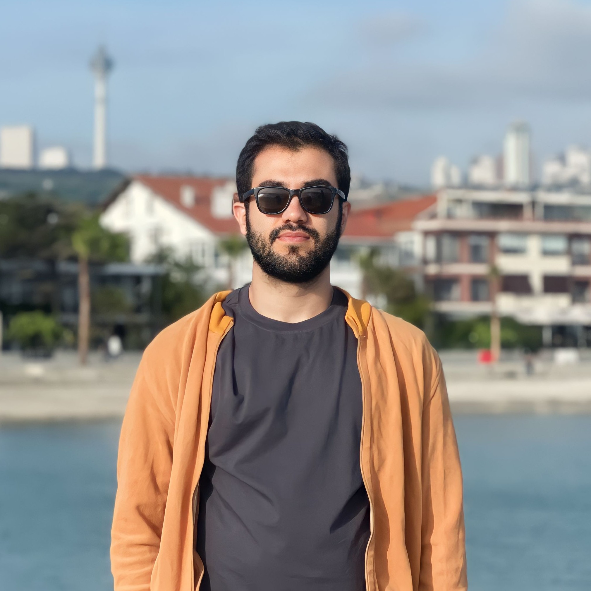

        

            
             
            
<a href="/files/cv.pdf">CV</a>  /  <a href="mailto:amirhossein_alimohammadi@sfu.ca">Email</a>  /  <a href="https://scholar.google.com/">Scholar</a>  /  <a href="https://github.com/alimohammadiamirhossein">Github</a>  /  <a href="https://twitter.com/">Twitter</a>
 
        

        

        
I am a Master student at Simon Fraser University co-advised by <a href="https://www.sfu.ca/computing/people/faculty/ali-mahdavi-amiri.html" target="_blank" rel="noopener noreferrer"> Ali Mahdavi-Amiri </a> and <a href="https://asgsaeid.github.io/" target="_blank" rel="noopener noreferrer">Saeid Asgari</a>. I am currently focused on generative models and how we can improve their performance. More broadly, I am interested in 3D Computer Vision and Graphics.

        
Previously, I completed my B.Sc. in Sharif University of Technology. I was fortunate to have two wonderful internships at <a href="https://www.epfl.ch/labs/vita/" target="_blank" rel="noopener noreferrer">VITA lab</a> working with <a href="https://people.epfl.ch/alexandre.alahi?lang=en" target="_blank" rel="noopener noreferrer">Alexandre Alahi</a>, and at <a href="https://en.sharif.edu/" target="_blank" rel="noopener noreferrer">Sharif University</a> working with <a href="https://www.ocf.berkeley.edu/~asgari/" target="_blank" rel="noopener noreferrer">Ehsaneddin Asgari</a>.

        

